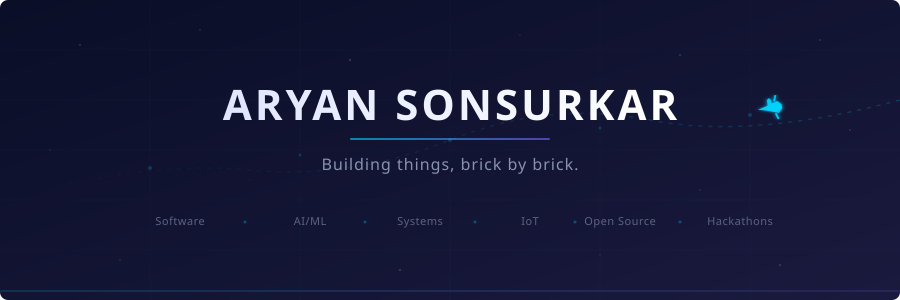
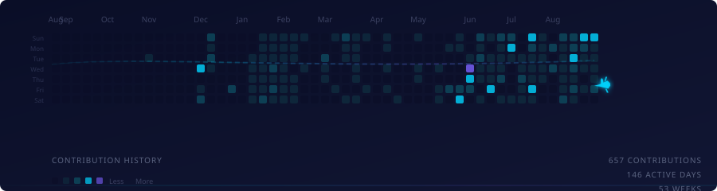
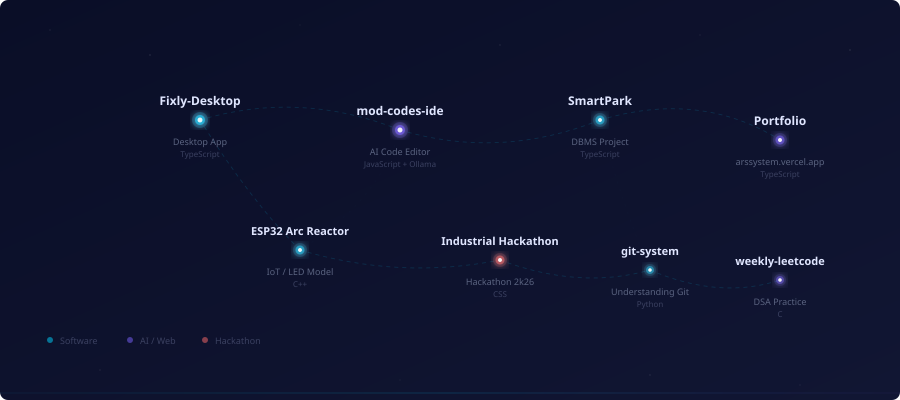
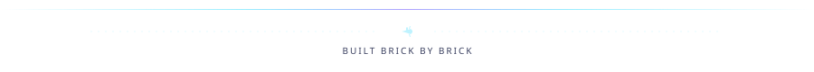

  

  <em>Computer Engineering student building things from scratch.</em> 
  <em>Python, ESP32, AI/ML, Software, IoT.</em>

  
  
  

---

## Flight Contribution Map

  

  Each cell represents a day. Color intensity reflects contribution activity. The airplane tracks the journey.

---

## Current Missions

<table>
  <tr>
    <td width="50%" valign="top">
      <h3><a href="https://github.com/aryan-sonsurkar/Fixly-Desktop">Fixly-Desktop</a></h3>
      
Desktop application built with TypeScript

      <code>TypeScript</code> · ⭐ 1
        
      <strong>Status:</strong> <code>ACTIVE</code>
    </td>
    <td width="50%" valign="top">
      <h3><a href="https://github.com/aryan-sonsurkar/mod-codes-ide">mod-codes-ide</a></h3>
      
AI-powered code editor using local Ollama models. Privacy-first alternative.

      <code>JavaScript</code> · ⭐ 1
        
      <strong>Status:</strong> <code>BUILDING</code>
    </td>
  </tr>
  <tr>
    <td width="50%" valign="top">
      <h3><a href="https://github.com/aryan-sonsurkar/SmartPark---DBMS">SmartPark---DBMS</a></h3>
      
Database management system project

      <code>TypeScript</code>
        
      <strong>Status:</strong> <code>BUILDING</code>
    </td>
    <td width="50%" valign="top">
      <h3><a href="https://github.com/aryan-sonsurkar/Industrial-Hackathon-2k26">Industrial-Hackathon-2k26</a></h3>
      
Siemens Industrial Hackathon 2026

      <code>CSS</code> · ⭐ 1
        
      <strong>Status:</strong> <code>EXPERIMENTING</code>
    </td>
  </tr>
</table>

---

## Project Constellation

  

<table>
  <tr>
    <td align="center" width="25%">
      <a href="https://github.com/aryan-sonsurkar/esp32-arc-reactor-desk-model">
        <strong>ESP32 Arc Reactor</strong>
      </a>
       
      Iron Man-inspired LED model
       
      <code>C++</code> · ⭐ 1
    </td>
    <td align="center" width="25%">
      <a href="https://github.com/aryan-sonsurkar/ESP32-OLED-Display">
        <strong>ESP32 OLED Display</strong>
      </a>
       
      OLED interfacing with Arduino IDE
       
      <code>C++</code> · ⭐ 1
    </td>
    <td align="center" width="25%">
      <a href="https://github.com/aryan-sonsurkar/esp32-traffic-light-signal">
        <strong>ESP32 Traffic Light</strong>
      </a>
       
      Real-world traffic signal prototype
       
      <code>C++</code> · ⭐ 1
    </td>
    <td align="center" width="25%">
      <a href="https://github.com/aryan-sonsurkar/Portfolio">
        <strong>Portfolio</strong>
      </a>
       
      arssystem.vercel.app
       
      <code>TypeScript</code>
    </td>
  </tr>
  <tr>
    <td align="center" width="25%">
      <a href="https://github.com/aryan-sonsurkar/git-system">
        <strong>git-system</strong>
      </a>
       
      Understanding how git works
       
      <code>Python</code> · ⭐ 1
    </td>
    <td align="center" width="25%">
      <a href="https://github.com/aryan-sonsurkar/draco-cli">
        <strong>draco-cli</strong>
      </a>
       
      CLI tool built while learning Python
       
      <code>Python</code> · ⭐ 1
    </td>
    <td align="center" width="25%">
      <a href="https://github.com/aryan-sonsurkar/weekly-leetcode">
        <strong>weekly-leetcode</strong>
      </a>
       
      One leetcode problem per week
       
      <code>C</code>
    </td>
    <td align="center" width="25%">
      <a href="https://github.com/aryan-sonsurkar/Full-Stack-Dev-Journey">
        <strong>Full-Stack Dev Journey</strong>
      </a>
       
      Learning full-stack development
       
      <code>HTML</code>
    </td>
  </tr>
</table>

---

## Tech Stack

  
  
  
  
  
  
  

  
  
  
  

---

## GitHub Activity

  
  

---

  

  I learn by building. I build brick by brick.

