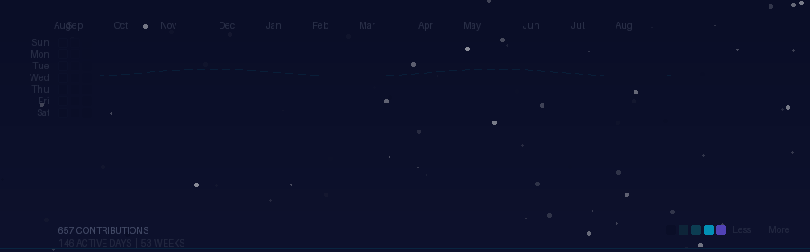
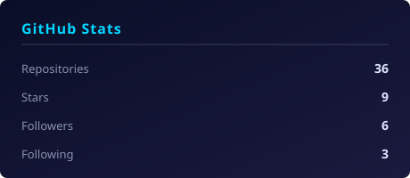
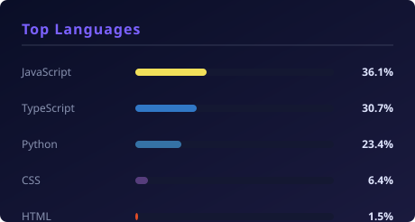

  

  <em>Diploma Computer Engineering student. I learn by building.</em>

---

## Flight Contribution Map

  

  Each cell is a day. Color intensity reflects contribution activity. The airplane traces the journey.

---

## What I'm Building

**[ModCode IDE](https://github.com/aryan-sonsurkar/mod-codes-ide)** — A browser-first coding environment built from scratch. Not cloning an IDE — understanding and building the underlying pieces brick by brick. Uses local Ollama models for AI assistance.

**[Industrial Hackathon 2k26](https://github.com/aryan-sonsurkar/Industrial-Hackathon-2k26)** — Siemens hackathon project. Working on a Business Analyzer-type solution with a team.

**Smart India Hackathon** — Joined a senior team's project as a junior. Learning by contributing to a real engineering problem.

**Agency** — Exploring real-world software projects with friends. Figuring out how to build things that people actually use.

---

## Tech Stack

  
  
  
  
  
  
  
  

---

## GitHub Activity

  
  

  Regenerated automatically every week.

---

## Philosophy

> **Learn → Build → Break → Fix → Ship**

I don't wait until I know everything. I start building, hit walls, debug, and figure it out along the way. Every project in this profile started with "let me try this" — not "let me plan this perfectly first."

---

## Find Me

- [GitHub](https://github.com/aryan-sonsurkar)
- [Portfolio](https://arssystem.vercel.app)
